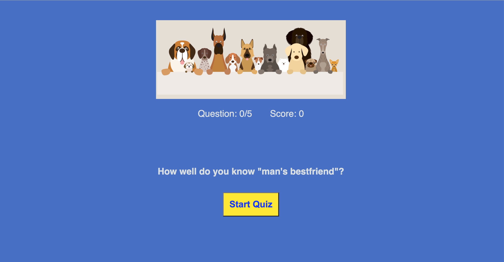
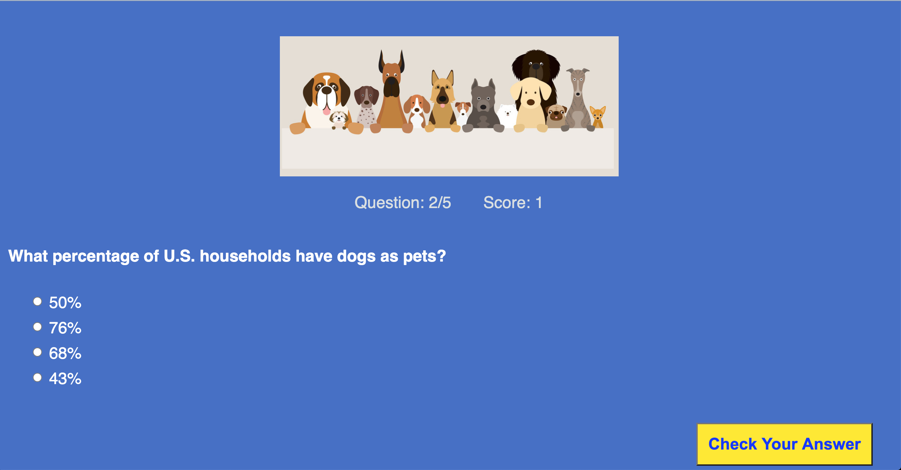

<h1> Dog Quiz App </h1>

Screenshots: 

Summary: This was my first project completed for the Bloc Web Develper program. Simple design quiz app that tests the user's knowledge on dogs.

Features: 

* Answer 5 questions about dogs
* Get feedback after each question 
* Receive final results after all questions have been answered

Languages Used: 
* HTML
* CSS
* JavaScript
* jQuery

Demo: 
<a href='https://tharwin-carr.github.io/dog-quiz-app/'> Live Demo</a>
